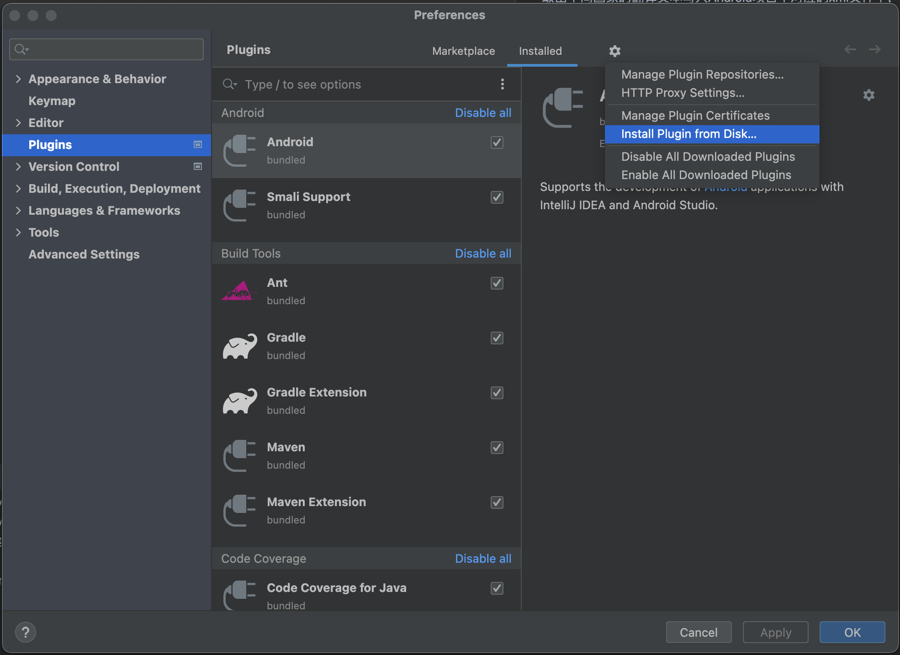
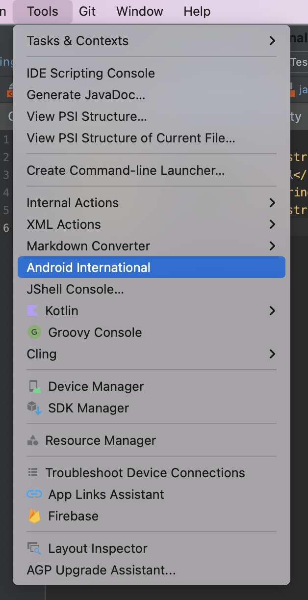
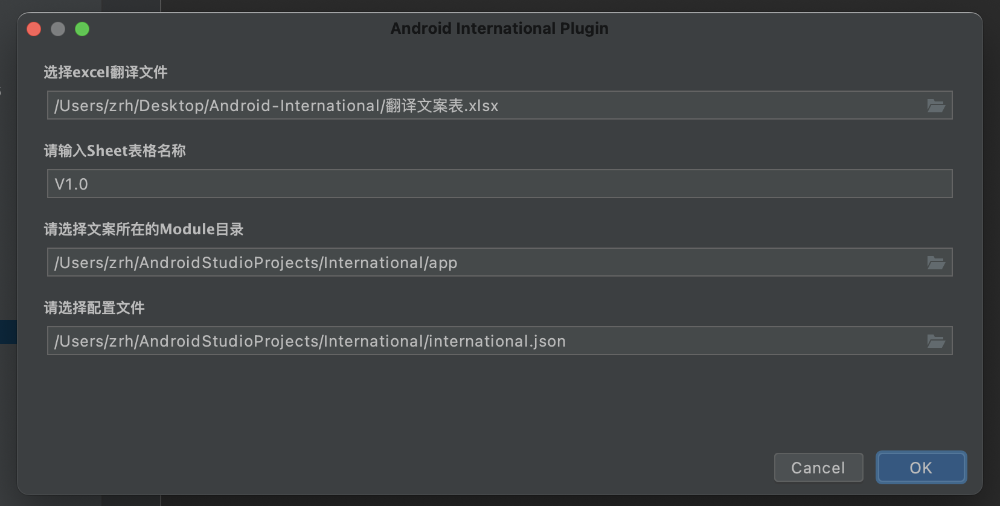
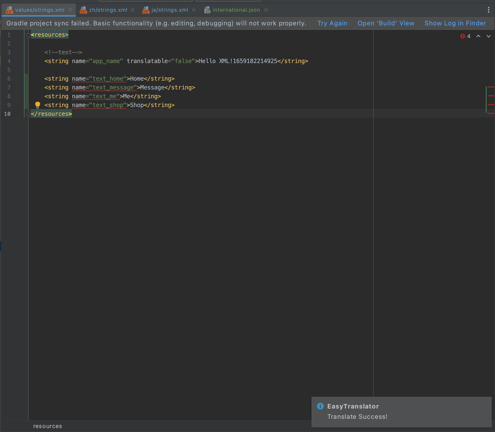

# Android Internation Plugin
Android项目国际化适配插件，可以将本地化组提供的excel翻译文件提取出不同国家的翻译文本写入Android项目中对应的xml文件中，以完成对国际化文本的适配工作。

## 使用步骤
### 1. 下载并安装插件。
[插件下载地址](https://github.com/zrheasy/Android-International-Plugin/releases/download/v1.0.0/AIP-1.0-SNAPSHOT.zip)


### 2. 在当前项目的根目录下新建配置文件international.json。
内容可参考[配置文件](assets/international.json)和[翻译文件](assets/翻译文案表.xlsx)
```json
{
  "tagNameIndex": 0,
  "defaultLanguage": "en",
  "textIndexMap": {
    "zh": 1,
    "en": 2,
    "ja": 3
  },
  "matchRegex": "",
  "useDefault": false
}
```

### 3. 打开配置窗口，输入配置信息。



### 4. 点击OK完成国际化适配。
